<div align="center">

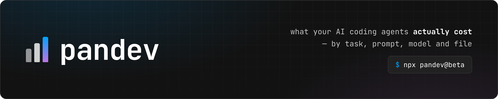

**What your AI coding agents actually cost — broken down by task, branch, model and file.**

Runs on your machine. No account, no telemetry — your logs never leave your laptop.

[](https://www.npmjs.com/package/pandev)
[](#requirements)
[](LICENSE)

```
npx pandev
```

**[pandev-metrics.com/cli](https://pandev-metrics.com/cli)** · **[npm](https://www.npmjs.com/package/pandev)** · [How to verify the privacy claim](docs/VERIFY.md) · [Changelog](CHANGELOG.md)

</div>

> [!TIP]
> **Stable is live.** `npx pandev` runs the current release on macOS (Apple Silicon and Intel)
> and Linux x64 — no install step, nothing else to set up. The parsers are verified against
> live logs. Want the freshest features a bit earlier? `npx pandev@beta` tracks the beta channel.

<details>
<summary><b>Windows</b> — the npm package is not published yet; use the installer from PowerShell</summary>
<br>

```powershell
iwr https://raw.githubusercontent.com/pandev-metriks/pandev-cli/main/install-experimental.ps1 -UseBasicParsing | iex
```

The command it installs is `pandev cost`.

</details>

<div align="center">
  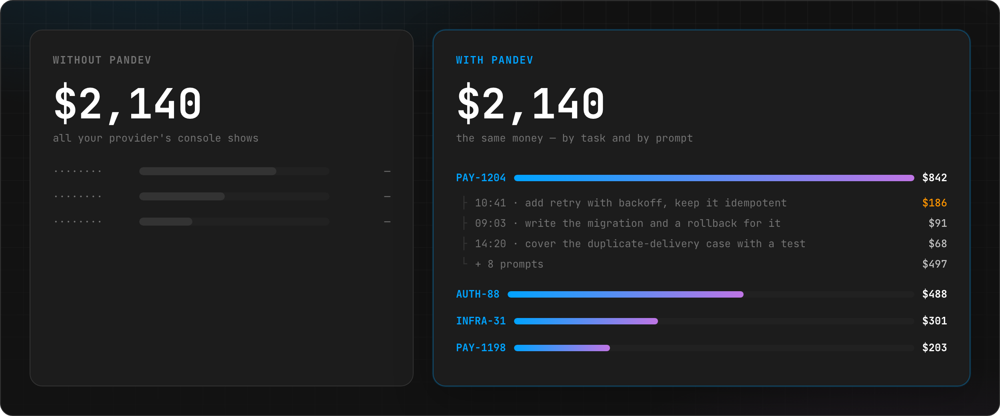
</div>

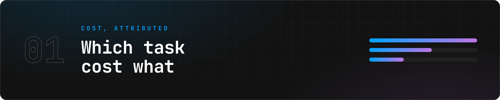

## The problem

Your agent bills you per token. Your work is organised in tasks. Nothing connects the two.

Every tool in this space reports *sessions*: "yesterday you spent $61." Useful once. It never
answers the question you actually have — **which piece of work was expensive, and why.**

<div align="center">
  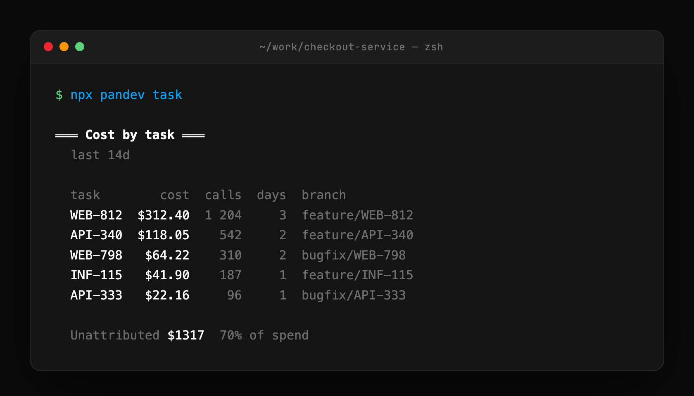
</div>

## Which task cost what

That is the table above, and it is the whole point of this tool.

Note its last line. Work that happened outside a repository, or on a branch with no ticket key
in its name, **cannot** be attributed — so it is reported as its own number instead of being
spread across the tasks to make the table look complete. `pandev task` breaks that remainder
down by project, so you can see what it consists of rather than guessing.

**Getting this right is harder than it looks.** Claude Code writes `HEAD` into its logs instead
of a branch name — every single event, no exceptions. Per-task numbers built naively from those
logs are wrong, and wrong by a lot: on our own data a single task came out overstated **70×**.
`pandev` reconstructs the real branch at each timestamp from `git reflog`. That reconstruction
is what makes the number above worth reading.


## Then: which prompt inside that task

Pick the expensive one and look inside it.

<div align="center">
  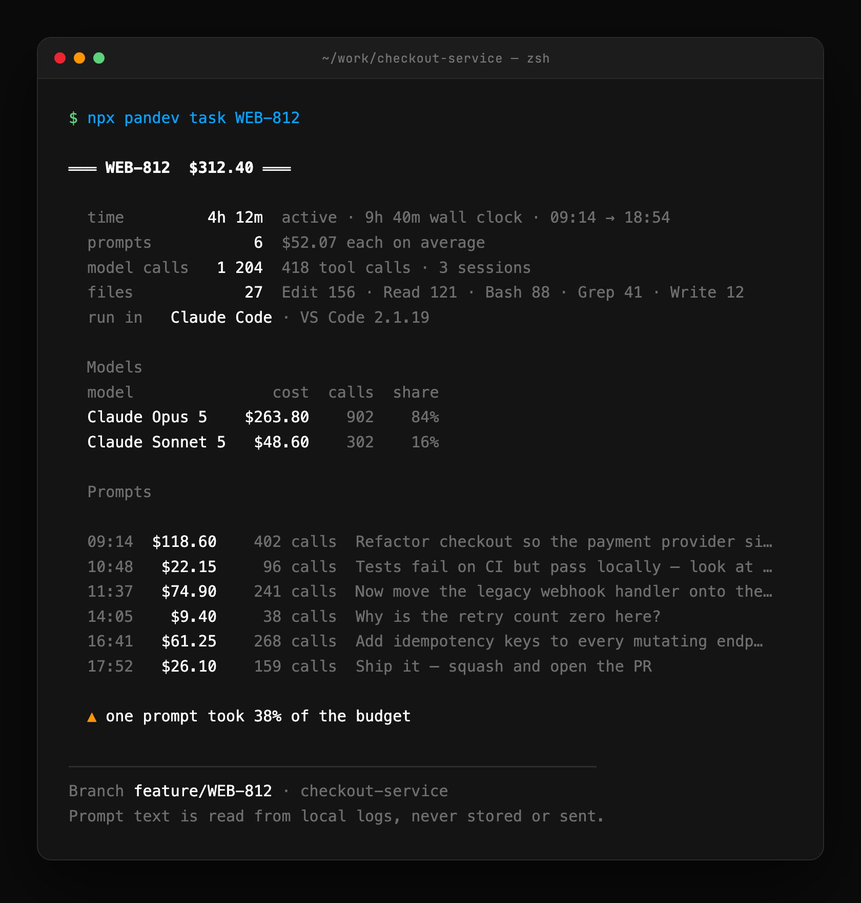
</div>

One prompt took 38% of the whole task. That is the actionable unit — not the day, not the
session, but the specific thing you asked for and what it cost to answer.

You also get what the totals hide: **active** time against wall-clock, which model actually did
the work, which editor it ran in, and how many rounds each file went through.

Prompt text is read straight from your local logs to print this. It is never stored and never
sent — see [Privacy](#privacy).

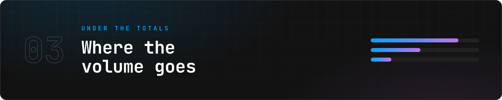

## And underneath: where the volume goes

<div align="center">
  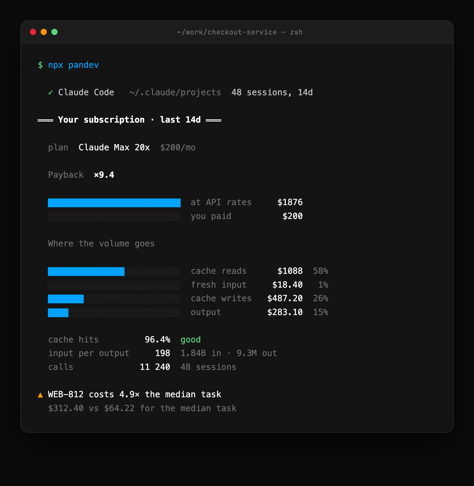
</div>

Cache reads, cache writes, fresh input and output are four different prices. A bill that looks
alarming is usually cache reads — and the fix for that is a prompt change, not less work. You
cannot see any of that from a single total.

If you are on a subscription rather than API billing, the same view tells you what your usage
would have cost at API rates, which is the only honest way to know whether the plan pays for
itself.


## The dashboard: your numbers, on a bookmark

`pandev web` serves all of the above as a live dashboard at **`http://127.0.0.1:4976`**
(loopback only — invisible from outside your machine; if the port is busy it walks up to 4985)
and opens it in your browser. Numbers refresh from your logs on every visit.

<div align="center">
  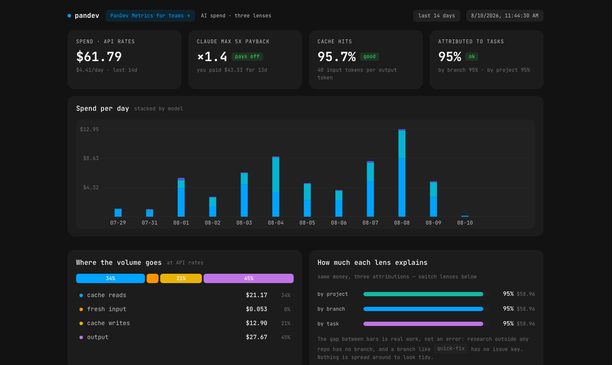
</div>

The same three lenses as the terminal — tasks, branches, projects — with every prompt priced
inside each task:

<div align="center">
  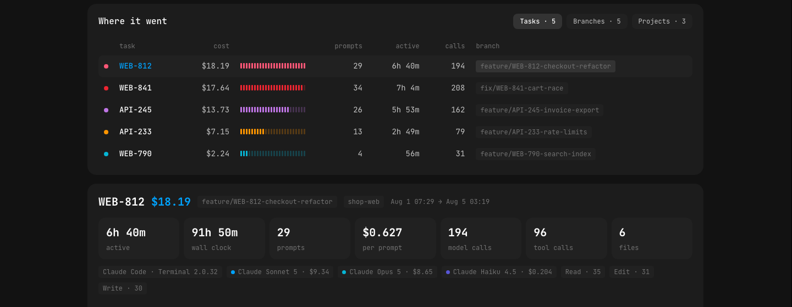
</div>

<div align="center">
  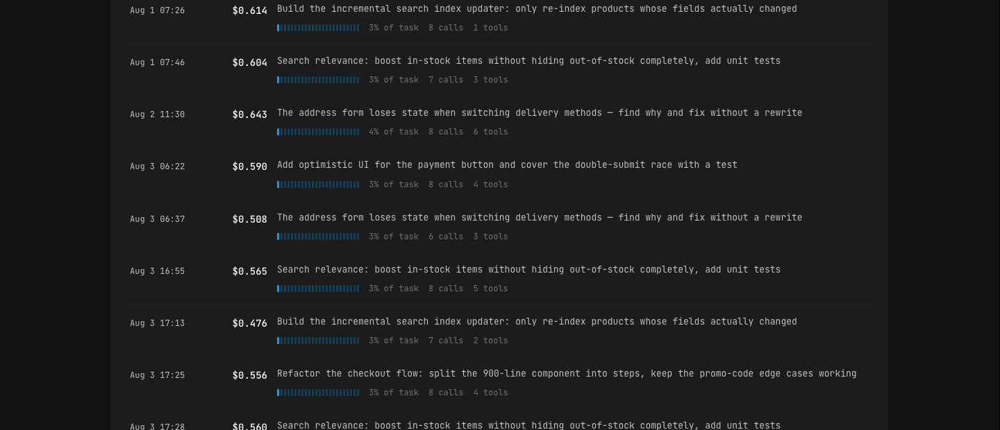
</div>

Two things worth knowing:

- **It can meet you at login.** `pandev autostart on` registers a user-level login item
  (launchd on macOS, systemd user unit on Linux) that starts the dashboard server and opens
  it once when you log in. The first interactive run offers this automatically — and tells
  you so; `pandev autostart off` removes every trace with one command. Bookmark the page
  (⌘D / Ctrl+D) and your spend is one keystroke away.
- **There is also a fully offline copy** — `~/pandev-cost.html`, a single self-contained
  file (`0600`, owner-only) that makes zero network requests. It contains your prompt text,
  so treat it like the logs it came from.

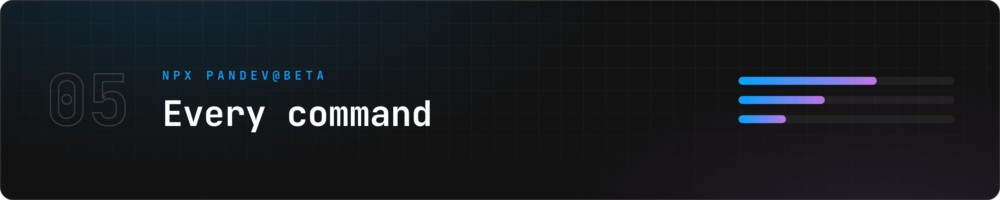

## Commands

| | |
|---|---|
| `npx pandev` | summary for the last 14 days |
| `npx pandev today` | today only |
| `npx pandev task` | cost per task |
| `npx pandev task WEB-812` | one task: every prompt, time spent, files touched, tools used |
| `npx pandev files` | cost by file, with edit rounds |
| `npx pandev models` | cost and cache behaviour per model |
| `npx pandev why cache` | how prompt caching actually played out |
| `npx pandev why ratio` | context read per unit of output |
| `npx pandev web` | dashboard at `http://127.0.0.1:4976` + offline copy (alias: `dashboard`) |
| `npx pandev autostart on\|off` | dashboard at login — on or off with one command |
| `npx pandev team` | team plans: book a live [demo](https://pandev-metrics.com/book) |
| `npx pandev privacy` | what is read, and what leaves this machine |

Add `--json` to any command for machine-readable output, `--days N` to change the window,
`--no-open` to serve the dashboard without touching your browser.


## Privacy

This tool reads your agent logs. Those logs contain your prompts, fragments of your code and
sometimes your secrets. You should not take anyone's word about what happens to them —
including ours.

So, plainly:

- **No outbound network calls from the binary.** No telemetry, no analytics, no accounts —
  there is nothing to sign into and nothing that phones home.
- **The dashboard server is loopback-only.** `pandev web` listens on `127.0.0.1:4976` and
  answers your own browser. It is not reachable from the network, and it sends nothing out.
- **One anonymous version check — from your browser, not the binary.** The served dashboard
  page asks `registry.npmjs.org` for the latest version number so it can tell you when a
  newer release is out. No data goes with it, and the offline file copy never does even that.
- **The login item is opt-out and transparent.** The first interactive run enables the
  dashboard-at-login service and says so in plain text; `pandev autostart off` removes it
  completely. Pipes, `--json` and CI never trigger it.
- **Nothing is written** except the dashboard file (`~/pandev-cost.html`, `0600`, owner-only)
  and — if autostart is on — the login item itself.

`npx pandev privacy` prints the full list of what is read and what is taken from it.

**And here is how to check that for yourself, without trusting us** — network activity is
observable from outside the process, so the claim is verifiable even though this is not open
source: **[docs/VERIFY.md](docs/VERIFY.md)**.

## Requirements

Node 20 or newer for `npx`. Optional but recommended: `git` on your `PATH` — without it,
per-task attribution is switched off and you get totals only. The dashboard wants port
`4976` free on localhost (it walks up to `4985` by itself if not).

Reads logs from:

- Claude Code — `~/.claude/projects`
- Codex CLI — `~/.codex/sessions`
- opencode — `~/.local/share/opencode/opencode.db`, read-only via your local `sqlite3`
- ZCode — `~/.zcode/cli/db/db.sqlite`, read-only via your local `sqlite3`

Nothing else is scanned.

## Working in a team?

This tool is deliberately single-player. It reads what is on *your* machine and answers
questions about *your* work.

If the question turned into "how does this compare across the team", "which projects burn the
most", or "what does AI actually cost us per delivered ticket" — that is
[PanDev Metrics](https://pandev-metrics.com), and it is a different product.
**[Book a live demo](https://pandev-metrics.com/book)** — or just run `npx pandev team`.

## License

Proprietary — see [LICENSE](LICENSE). Free to install and run on machines you own or control,
including at work. Redistribution, modification and derivative works are not permitted.

Cost figures are estimates computed from published provider rate tables. They are not an
invoice. Reconcile against your provider's own billing.

---

<div align="center">
<sub>Built by <a href="https://pandev-metrics.com">PanDev</a> · <a href="https://pandev-metrics.com/cli">pandev-metrics.com/cli</a> · <a href="https://www.npmjs.com/package/pandev">npm: pandev</a> · <a href="https://pandev-metrics.com/book">team demo</a> · Found a bug? <a href="../../issues/new/choose">Open an issue</a></sub>
</div>
